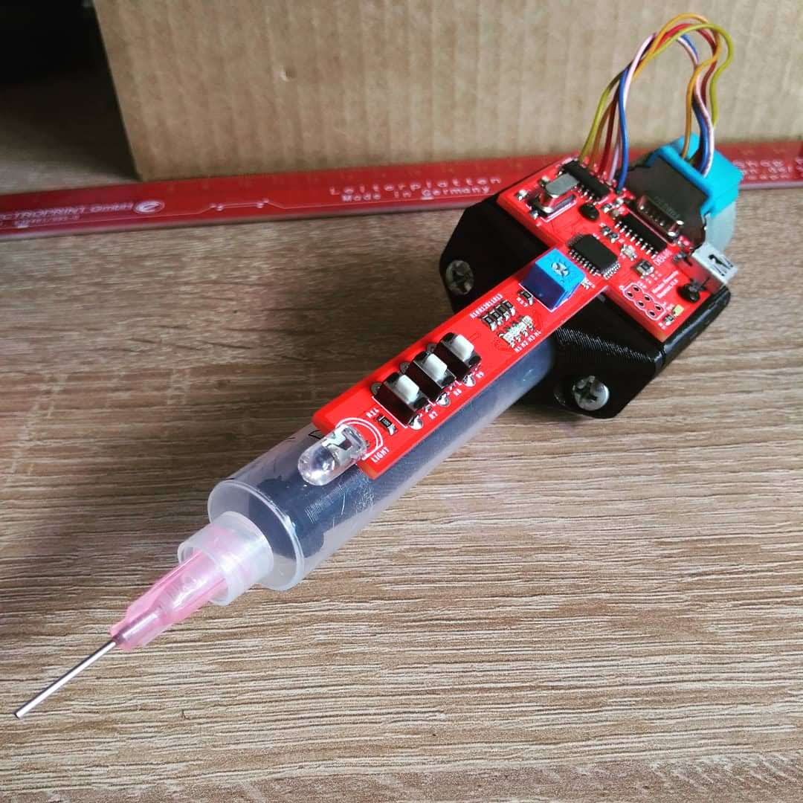

# Solder paste dispenser

#Change Log

Version 1.1 [HW v1.1, SW v1.1]
- pridana funkcia auto pull efektu. Toznamena, ze po pusteni PUSH tlacidla sa krokovy motor otoci o X krokov spat, vdaka comu prestane tlacit na spajkovaciu pastu. Efekt mozete zapnut pomocou definicie **M_A_PULL_E** v subore **MCU_cfg.h**.  Definiciou **M_A_PULL_ST** nastavujete pocet krokov o kolko sa krokov motor vrati spet. Tuto hodnotu je potrebne odladit pre kazdeho uzivatela, no myslim ze 100 krokov bude dost. Definiciou **M_A_PULL_SP** nastavite rychlost otacania krokoveho motora, pri otacani.
- pridany vypis SW verzie do konzoly
- aktualizovana doxygen dokumentacia

Version 1.2 [HW v1.1, SW v1.2]
- pridana moznost zapnutia/vypnutia auto pull modu pomocou tlacidiel.  Defaultne je auto pull mod vypnuty, pomocou definicie **M_A_PULL_E**. Pre zapnutie je potrebne podrzat 5 sekund tlacidlo **MODE**. Po 5 sekundach zsvieti led **STATUS** na 1 sekundu. Vtedy je potrebne pustit tlacidlo **MODE**. Touto sekvenciou bol zapnuty auto pull mod. Ak ho chcete vypnut, znova je potrebne podrzat 5 sekund tlacidlo  **MODE**. Volba zapnutia/vypnutia auto pull modu sa neuklada do EEPROM pamete, cize po kazdom restarte je nastavena na hodnotu v definicii **M_A_PULL_E**.
- aktualizacia doxygen dokumentacie

Version 1.3 [HW v1.2, SW v1.2]
- pridany kondenzator 1uF k napajaniu MCU
